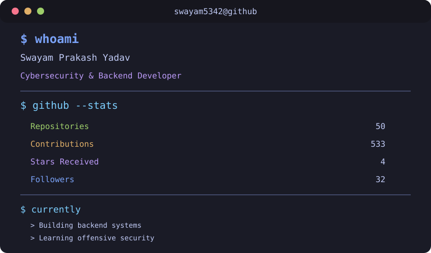

# 👨‍💻 About Me

```rs
use std::collections::HashMap;

struct Programmer {
    name: &'static str,
    age: u32,
    socials: HashMap<&'static str, &'static str>,
    interests: Vec<&'static str>,
    languages: Vec<&'static str>,
    coffee: bool,
}

fn main() {
    let mut socials = HashMap::new();

    socials.insert("Discord", "swayamm5342");
    socials.insert("Instagram", "swayam5342_");
    socials.insert("LinkedIn", "swayam5342");

    let swayam = Programmer {
        name: "Swayam",
        age: 19,
        socials,
        interests: vec![
            "Cybersecurity",
            "Backend Development",
            "AI",
            "Astronomy",
            "Books",
            "Music",
        ],
        languages: vec![
            "Python",
            "Go",
            "TypeScript",
            "Rust",
        ],
        coffee: true,
    };

    println!("Thanks for visiting!");
}
```

---

# 🚀 Featured Projects
- 🔐 Cybersecurity tools & experiments
- 🌐 Backend APIs and systems
- 🍓 Raspberry Pi projects

---

# 🔐 Cybersecurity Interests

- Web Security
- Networking
- Linux
- Reverse Engineering
- CTF Challenges
- OSINT

---

# 📚 Currently Learning

- Rust
- Backend Development
- AI Engineering
- Offensive Security
- System Design

---

# 🛠️ Languages & Tools

<p align="left">
  
</p>

<picture>
  <source media="(prefers-color-scheme: dark)" srcset="./assets/dark_mode.svg">
  <source media="(prefers-color-scheme: light)" srcset="./assets/light_mode.svg">
  
</picture>

# 🌐 Connect With Me

[](https://www.linkedin.com/in/swayam5342)
[](https://www.instagram.com/swayam5342_/)
[](https://discord.com/)

---


