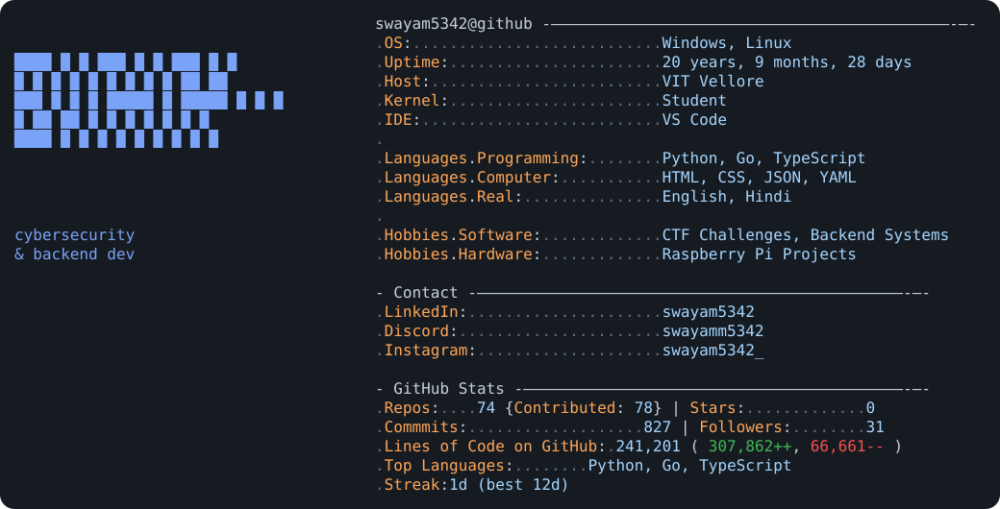

# 👨‍💻 About Me
<picture>
  <source media="(prefers-color-scheme: dark)" srcset="./dark_mode.svg">
  <source media="(prefers-color-scheme: light)" srcset="./light_mode.svg">
  
</picture>

---

# 🚀 Featured Projects
- 🔐 Cybersecurity tools & experiments
- 🌐 Backend APIs and systems
- 🍓 Raspberry Pi projects

---

# 🔐 Cybersecurity Interests

- Web Security
- Networking
- Linux
- Reverse Engineering
- CTF Challenges
- OSINT

---

# 📚 Currently Learning

- Rust
- Backend Development
- AI Engineering
- Offensive Security
- System Design

---

# 🛠️ Languages & Tools

  

---

# 📊 GitHub Stats

---

# 🌐 Connect With Me

---

